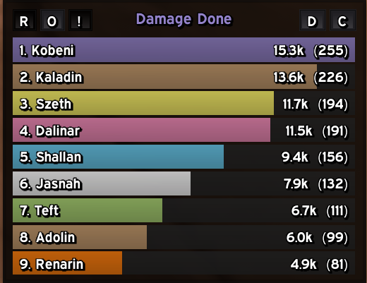
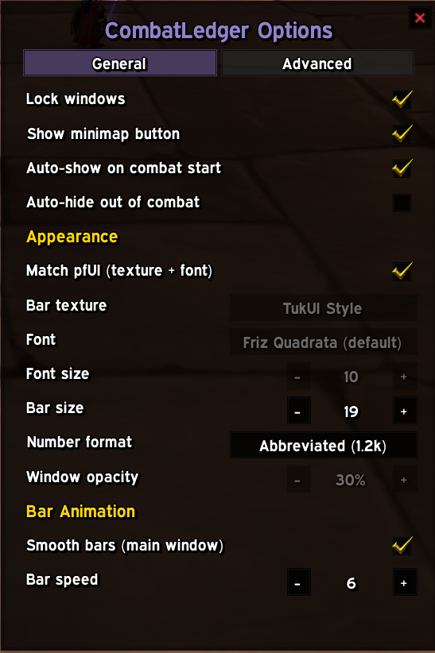
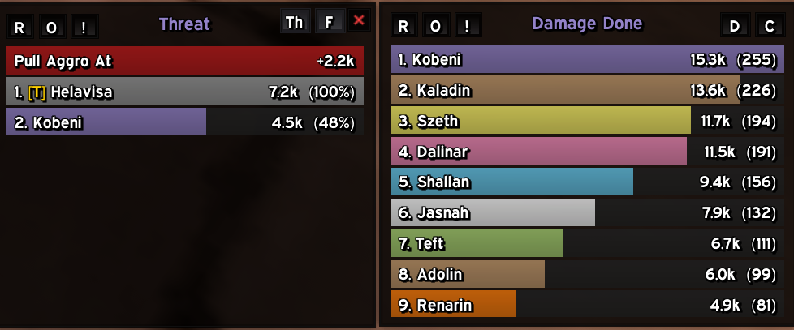
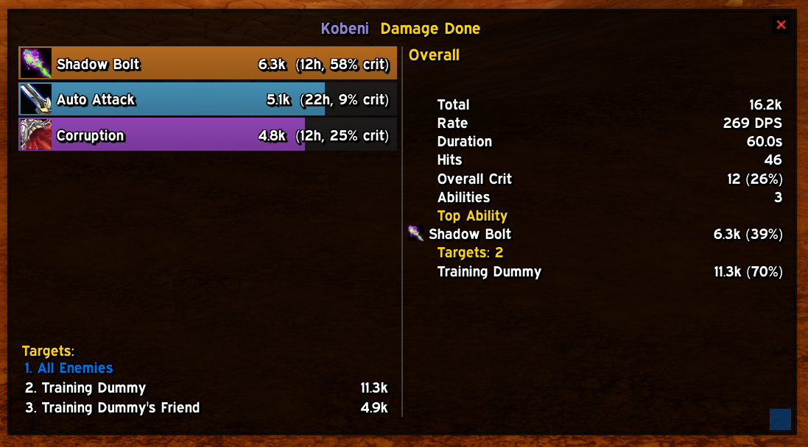

# CombatLedger

A combat meter for 1.12 WoW, built on [Nampower](https://github.com/namreeb/nampower)'s structured combat events instead of parsing chat-log text.

<table>
  <tr>
    <td align="center" width="50%">
       
      <b>Main window</b> — Damage Done
    </td>
    <td align="center" width="50%">
       
      <b>Options</b>
    </td>
  </tr>
  <tr>
    <td align="center" width="50%">
       
      <b>Threat mode</b> alongside a second window, each independent
    </td>
    <td align="center" width="50%">
       
      Click any bar for a full <b>per-ability, per-target breakdown</b>
    </td>
  </tr>
</table>

## Why that matters

Every other combat meter on 1.12 works the same way: it registers `CHAT_MSG_COMBAT_*` and reads the localized string the client prints to your chat window — "Your Sinister Strike hits Bob for 214." That string is what the *client* renders for a human to read, not real combat data, and every meter built on it inherits the same limits:

- **Locale-dependent.** The parser has to match the exact phrasing the client generates, which changes per language.
- **Throttled and lossy.** The combat log can drop or coalesce lines under heavy event volume, silently undercounting.
- **No reliable identity.** Two units can share a display name (two "Skeleton"s, a duplicate player name across realms/eras); a text parser has no way to tell them apart, so damage gets misattributed.
- **Derived, not measured.** Things like crit, glancing blows, overheal, or a dispelled effect's identity have to be reverse-engineered from phrasing rather than read as an actual field.

CombatLedger instead listens to Nampower's own combat events — `AUTO_ATTACK_SELF/OTHER`, `SPELL_DAMAGE_EVENT_SELF/OTHER`, `SPELL_HEAL_BY_*`, `SPELL_DISPEL_BY_*`, and the aura-cast/debuff-added pair used to attribute debuffs. These carry the real numeric fields the server actually sent: a GUID for every unit involved, the exact spell ID, the raw damage/heal amount, and a hit-type bitfield — the same shape of data a modern client gets natively, just recovered here through Nampower's client-side hooks instead of Blizzard's own API (which 1.12 doesn't expose). Nothing is inferred from a sentence.

## What it tracks

- **Damage Done / Healing Done / Damage Taken** — with a full per-ability, per-target breakdown behind every bar (click to open it).
- **Dispels** and **Debuffs Given** — dispels come straight from Nampower's dispel event; debuffs given are attributed by correlating the aura-cast event (who cast it) with the immediately following debuff-added event (confirming it actually landed as a debuff, not a buff), rather than guessing from spell name.
- **Deaths** — with a hit-by-hit recap of exactly what killed each tracked unit, built from a rolling combat buffer rather than a single killing-blow line.
- **Threat** — a live per-target threat display sourced from the server's own `UnitDetailedThreatSituation` addon-message API, including a "pull aggro at" reference line showing exactly how much more threat you can generate before you pull off the current target.

Every mode has **Current Fight**, session-long **Overall**, and a scrollable **History** of past encounters, independently switchable per window. You can run as many meter windows as you want at once, each with its own mode, segment, size, and position — track Damage in one and Healing in another simultaneously.

CombatLedger also announces **who pulled** a boss/elite encounter and with what ability, straight to chat — toggleable in Options.

## Requirements

- **[Nampower](https://github.com/namreeb/nampower)** — required. This is the client hook layer CombatLedger's entire event pipeline is built on; without it, none of the combat events used here exist.
- **[pfUI](https://github.com/shagu/pfUI)** — optional. If installed, CombatLedger can mirror pfUI's bar texture, font, and window skin so it matches the rest of your UI.

## Installation

Drop the `CombatLedger` folder into your `Interface/AddOns` directory, alongside Nampower. Enable it at the character select screen like any other addon.

## Usage

- `/cl toggle` (or just `/cl`) — show/hide the main meter window.
- `/cl options` — lock/minimap/appearance settings, and window management.
- `/cl history` — the saved-encounters list.
- Click any bar to open its per-ability, per-target breakdown.
- Right-click the minimap icon (or the meter window's Options button) for everything else.

## Roadmap

Not built yet, in no particular order:

- **Encounter Comparison Tool** — line up two saved encounters against each other (say, the same boss on two different pulls) to see what actually changed.
- **Interrupts** — melee interrupts (Kick, Pummel) already have a real signal available from Nampower; pure spell-cast interrupts (Counterspell, Spell Lock) don't have a confirmed one yet.
- **CC / CC Breaks** — crowd control applied, and broken early, likely on the same debuff-correlation pipeline Debuffs Given already uses.
- **Raid Prebuff Inspector** — a live check of which raid buffs each party/raid member is actually missing, based on class/spec. A different model from everything else here, since it needs to work before combat starts rather than per-encounter.

## Credits

The default appearance is styled after [pfUI](https://github.com/shagu/pfUI) by Eric Mauser (Shagu). Bundled directly from it, under pfUI's MIT license, so all of this is available without requiring pfUI itself:

- Bar textures (`img/bar.tga` plus the ElvUI/Gradient/Striped/TukUI alternates - resized square from pfUI's originals, since this client only loads square status bar textures)
- The soft window shadow (`img/glow2.tga`)
- The Expressway font (`fonts/Expressway.ttf`)

The window/button border and background colors are a flat near-black matching pfUI's own minimal style. "Smooth Gradient" (`img/bar_smooth.tga`) is this addon's own generated texture, not from pfUI - Blizzard's own gradient bar texture doesn't load on this client either (same square-only limitation).
